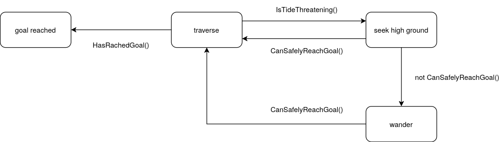

# TidalWalking

A Unity simulation of an autonomous agent navigating procedural terrain while avoiding rising and falling tidal waters. The agent must traverse from one corner of a terrain to the opposite corner while a water level oscillates in a linear cycle. When the tide threatens the agent's planned path, it must seek high ground and wait for the tide to recede before resuming its journey.

## Overview

The agent starts at one corner of a procedurally generated terrain and must reach the goal at the opposite corner. A water level continuously rises and falls between 0.5m and 7.0m. The agent uses **A\* pathfinding** on a terrain graph, combined with **tide-aware arrival-time prediction**, to plan safe paths. If the tide threatens its route, the agent transitions through a **finite state machine** (FSM) to seek high ground, wander safely, or resume travel when conditions improve. The agent must always be moving and can never enter a flooded region.

## Documentation

- [Tidal Walking.pdf](description/Tidal%20Walking.pdf) -- Project requirements and design specification
- [Project Documentation.pdf](description/project%20documentation.pdf) -- Full implementation details

## Features

- **Procedural terrain generation** using multi-octave Perlin noise with guaranteed safe start/goal zones
- **Tidal water simulation** with linear oscillation (26-second cycle)
- **Graph-based pathfinding** built from a 2m grid over the terrain (~1250 nodes, 8-directional edges)
- **A\* and Dijkstra solvers** with terrain-aware edge weighting (uphill penalty, low-ground penalty)
- **Tide-aware pathfinding** that predicts water levels at future arrival times and samples intermediate edge points
- **Finite state machine** with 4 states: Traverse, Seek High Ground, Wander, Goal Reached
- **Surface-normal orientation** so the agent aligns to terrain slopes
- **Third-person follow camera** with smooth interpolation

## Architecture

```
Assets/
├── Terrain/
│   ├── PerlinTerrain.cs          -- Procedural terrain generation (5-octave Perlin noise)
│   └── WaterController.cs        -- Tidal water oscillation and prediction
├── Pathfinding/
│   ├── Graph/
│   │   ├── Graph.cs              -- Adjacency-list directed graph
│   │   ├── Node.cs               -- Graph node
│   │   ├── Edge.cs               -- Directed weighted edge
│   │   ├── TerrainGraph.cs       -- Builds graph from terrain heightmap
│   │   └── TerrainGraphManager.cs -- MonoBehaviour for graph lifecycle + debug viz
│   ├── DijkstraSolver.cs         -- Dijkstra's shortest-path algorithm
│   ├── AStarSolver.cs            -- A* shortest-path algorithm with heuristic
│   ├── DijkstraSquare.cs         -- Visual grid-based Dijkstra demo
│   └── AStarSquare.cs            -- Visual grid-based A* demo
└── Agent/
    ├── FSM.cs                    -- Generic finite state machine framework
    ├── AgentController.cs        -- Main agent controller with tide-aware FSM
    └── ThirdPersonCamera.cs      -- Smooth third-person follow camera
```

## Terrain System

The terrain is 50m wide x 100m long x 10m tall, generated using 5 octaves of Perlin noise with configurable scale, persistence, and random seed. Both the start corner `(0,0)` and goal corner `(maxZ, maxX)` are constrained to a minimum height of 8.5m within a safe zone radius of 8m using Hermite interpolation, ensuring the agent always has viable start and end points above the maximum water level.

## Water System

The water level follows a linear saw-tooth oscillation:
- Rises from **0.5m** to **7.0m** at **0.5m/s** (13 seconds)
- Falls from **7.0m** to **0.5m** at **0.5m/s** (13 seconds)
- Total cycle duration: **26 seconds**

## Pathfinding

The terrain is discretized into a regular grid with 2m spacing. Each node connects to its 8 neighbors (cardinal + diagonal). Edge weights encode three factors:

| Factor | Effect |
|---|---|
| **Euclidean distance** | Base traversal cost |
| **Uphill penalty** | Moving to higher ground doubles the cost (simulates slower uphill movement) |
| **Low-ground penalty** | Moving below 7.1m adds `(7.1 - height) x 6` to the cost, strongly discouraging flood zones |

The graph is dynamically rebuilt to exclude nodes submerged below the current water level. A custom A\* heuristic combines Euclidean distance with a bias toward higher terrain by subtracting a term proportional to the node's height, naturally favoring elevated paths.

## Agent FSM

The agent operates through four states. Transitions are evaluated in order each frame; the first condition that returns true fires. There is no exit from Goal Reached -- it is a terminal state.

<picture>
  <source media="(prefers-color-scheme: dark)" srcset="description/FSM-dark.png">
  <source media="(prefers-color-scheme: light)" srcset="description/FSM-light.png">
  
</picture>

### States

- **Traverse** -- Plans and follows an A\* path to the goal. Continuously monitors up to 8 upcoming nodes for tide threats by sampling intermediate edge points and predicting water levels at estimated arrival times. If a threat is detected, transitions to Seek High Ground.
- **Seek High Ground** -- Entered when the tide threatens the planned path. First attempts to preserve progress by truncating the current path to only the safe portion (nodes above maximum water level). If no safe continuation exists, computes a new path to the nearest high-ground node. Transitions back to Traverse when the tide recedes and a safe path to the goal becomes available. Transitions to Wander if no progress can be made.
- **Wander** -- A holding state entered when the agent reaches safe ground but cannot resume goal-directed travel. Periodically attempts to find a path toward the goal and follows any safe portion. Picks random safe neighbors when no progress is possible. Only transitions back to Traverse (not to Seek High Ground).
- **Goal Reached** -- Terminal state. The agent stops moving and no further transitions are evaluated.

### Tide Prediction

The agent performs predictive safety analysis by looking ahead up to 8 nodes on its planned path. For each edge, it:
1. Estimates travel time based on distance and speed (flat: 1 m/s, uphill: 0.5 m/s)
2. Samples 5+ intermediate points along the edge to catch terrain dips between nodes
3. At each sample, projects onto the terrain to get actual ground height and checks it against the predicted water level at the estimated arrival time
4. If any sample point would be submerged, the tide is flagged as threatening

This also tracks the furthest safe node ahead, allowing the agent to continue forward to that node rather than immediately retreating.

### Path Continuity

When a new path is computed (due to replanning or state transitions), the agent does not restart from the first node. Instead it compares the forward direction of the old and new paths using a dot product. If the new path is roughly aligned, the agent selects the closest forward-compatible node on the new path to preserve momentum and avoid oscillatory backtracking.

## Constraints

- The agent must always be moving - it cannot stop
- The agent cannot enter flooded regions
- Start and goal corners are guaranteed above 7.5m (code uses 8.5m for additional safety margin)

## Requirements

- **Unity 6** (6000.0.58f2)
- **Universal Render Pipeline (URP)**

## Third-Party Assets

- [Yughues Free Sand Materials](https://assetstore.unity.com/packages/2d/textures-materials/sand/free-sand-textures-80967) -- Sand textures for terrain rendering
